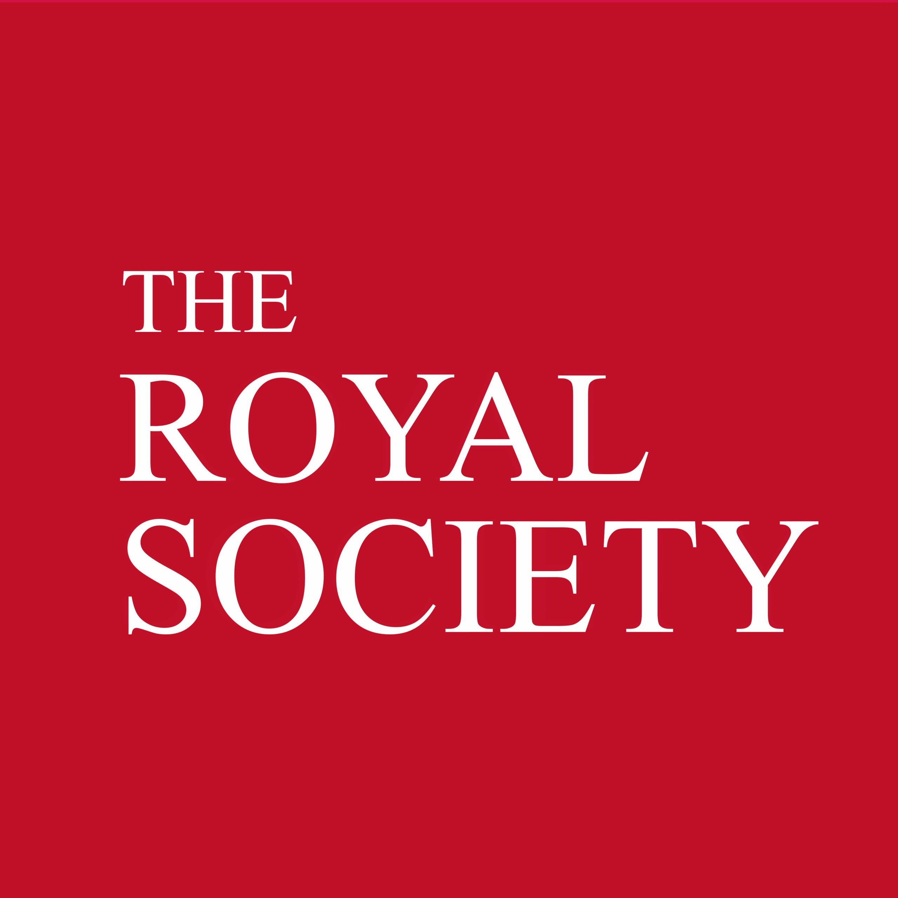

---
hide:
  - navigation
---

# **C**omputer-**A**ided **S**upramolecular **C**hemistry **Lab**oratory

### Using automation, computation, and data to shift supramolecular chemistry **from discovery to design**.

We are a young research group at [Durham University](https://www.durham.ac.uk/departments/academic/chemistry/) working at the interface of **supramolecular chemistry**, **automation**, and **data-driven molecular design**.
Our mission is to bridge **computational modelling** and **robotic experimentation** to accelerate the creation of functional molecular systems — from molecular cages and receptors to responsive materials and catalysts.

!!! tip "From Molecular Design to Real-World Impact 🔬"
    Inspired by nature’s precision, we design synthetic molecules that can **recognise**, **react**, and **adapt**.
    Using computers, laboratory automation, and a data-first approach, we aim to solve pressing challenges in areas such as **pollution control**, **chemical sensing**, and **catalysis**.

We take inspiration from the **elegant complexity of biological systems** — such as enzymes that selectively bind molecules and steer reactions.
Our work explores how to recreate these behaviours using **designed supramolecular systems**.

We combine:

- **Computational modelling** to predict molecular properties and interactions
- **Automated synthesis and high-throughput experimentation** to generate reliable data at scale
- **Closed-loop workflows** that continuously refine design through experimental feedback

This integrated approach transforms supramolecular chemistry from a trial-and-error process into a **predictive, modern, and digital field**, helping us *refine our understanding* of the underlying chemical processes.

 

#### We are grateful to our funders!

