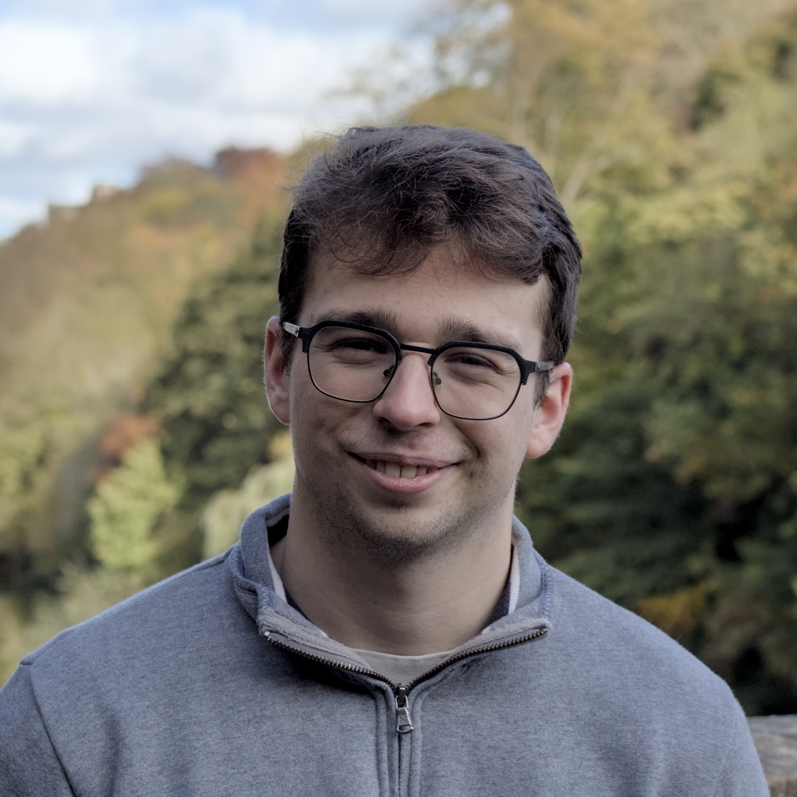
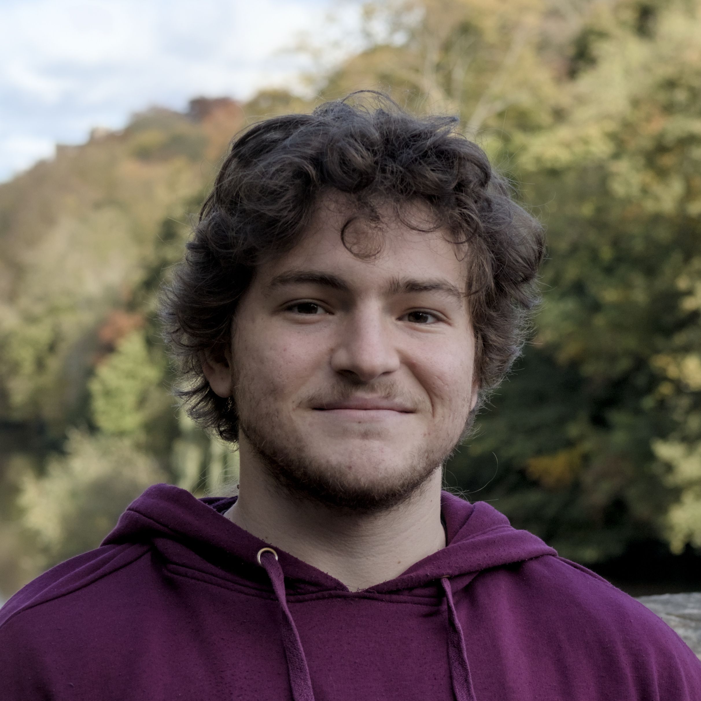
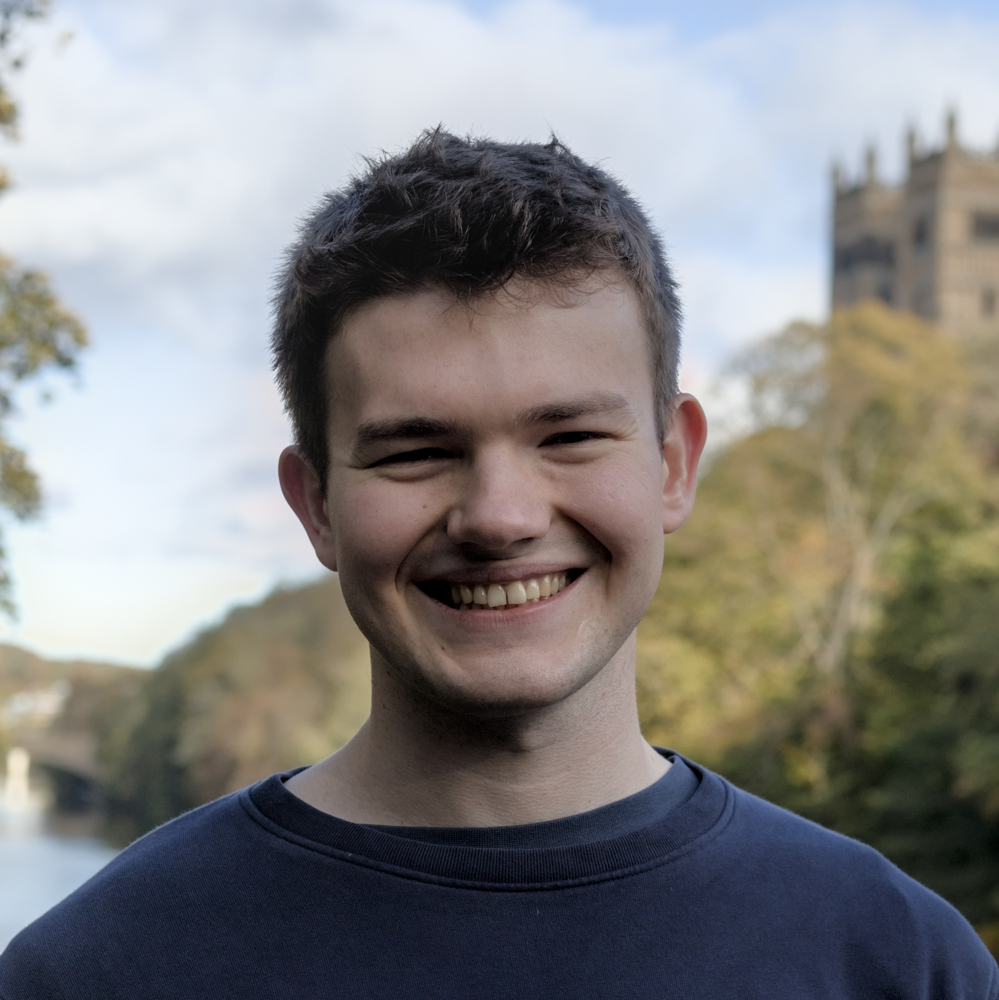

# Current group members

## Principal Investigator

{ .member-photo }
### Dr Filip Szczypiński [:fontawesome-brands-orcid:](https://orcid.org/0000-0003-3174-8532) [:fontawesome-solid-graduation-cap:](https://scholar.google.co.uk/citations?user=DJLqVIEAAAAJ)

*Royal Society University Research Fellow (2025 - now)*   
*Assistant Professor of Chemistry Automation (proleptic)*

Filip Szczypiński is a Royal Society University Research Fellow and Assistant Professor of Chemistry Automation at Durham University, which he joined in 2025.
He studied Natural Sciences at the University of Cambridge, where he investigated host–guest interactions in the group of Prof. Jonathan Nitschke.
He stayed on at Cambridge for his PhD with Prof. Chris Hunter FRS, exploring molecular recognition through programmed hydrogen-bonding interactions.
He then held postdoctoral positions in computational chemistry at Imperial College London (with Prof. Kim Jelfs) and in robotic chemistry at the University of Liverpool (with Prof. Andy Cooper FRS).

Filip’s research combines laboratory automation, high-throughput experimentation, and data-driven approaches to accelerate the discovery and development of functional molecules and materials.
His main focus is on bridging computational design with experimental execution, particularly in supramolecular and physical organic chemistry.
He has contributed to the development of autonomous robotic platforms for chemical synthesis, moving beyond reaction optimisation toward the discovery of previously unknown molecules.

Outside the lab, Filip enjoys travelling, food (eating, cooking, growing), and wine.
He has been seen organising tasting sessions, giving talks on wine chemistry, and competing in blind wine tasting around the world.

## PhD students

{ .member-photo }

### Tom Richards

*Master of Chemistry (2025)*

Tom joined the Szczypiński Group after completing his MChem degree at the University of Liverpool, where his Master’s research focused on the design of heterogeneous photocatalysts. He gained industrial experience at AstraZeneca within the Oncology Chemistry team, where he developed workflows for late-stage functionalisation. Tom also undertook an international research internship in the Chavasiri Group at Chulalongkorn University, Bangkok, where he explored natural product chemistry.

His research interests include organic synthesis, chemical automation, and supramolecular chemistry. Outside the lab, Tom enjoys kickboxing, travelling, and socialising with friends.

{ .member-photo }

### Pierre-Louis Valero

*Master of Chemistry (2024)*   
*Master of Science in Computer Science (2025)*

Pierre-Louis completed both his Chemistry and Computer Science degrees at Newcastle University. His master thesis in Chemistry revolved around a reaction-based design workflow for NLRP3 inhibitors to ensure computationally generated molecules were synthetically feasible. His thesis in computer science revolved around the automation of NMR spectra interpretation using pretrained BERT models to characterise molecules robustly. Both research projects directed him towards automation chemistry and the optimisation of chemical processes, and eventually to this group.

His research interests lie in automation of chemical processes (robots!) as well as automation of data analysis, and more precisely deconvolution of complex spectra with overlapping signals to characterise ratios of different mixtures or unknown products. In parallel to his chemistry degree, Pierre worked at Nanovery part-time for 2 years as an intern, a start-up focused on the development of Nucleic Acid Nanorobots. Outside of working, Pierre enjoy powerlifting, armwrestling, hiking and various obscure French spirits.

## Masters students

{ .member-photo }

### Michael Heron

Michael Heron is a fourth-year MChem student at Durham University, currently conducting research in the Szczypiński group. His project focuses on high-throughput dynamic covalent chemistry, developing combinatorial imine libraries for bowl-shaped receptors. Previously, Michael completed a summer internship in Dr Keith Andrews’ group, funded by an RSC Undergraduate Research Bursary, where he synthesized novel functionalised triptycenes and applied DFT methods to estimate their pKa values.

In his spare time he enjoys long distance running, weightlifting, and making different variations of overnight oats.

